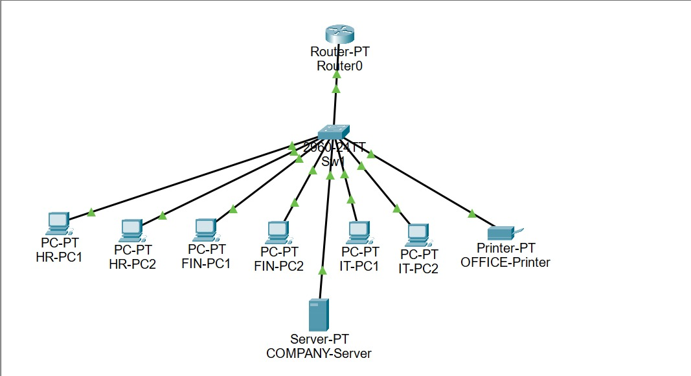
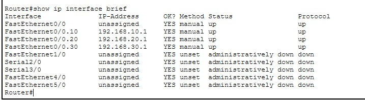
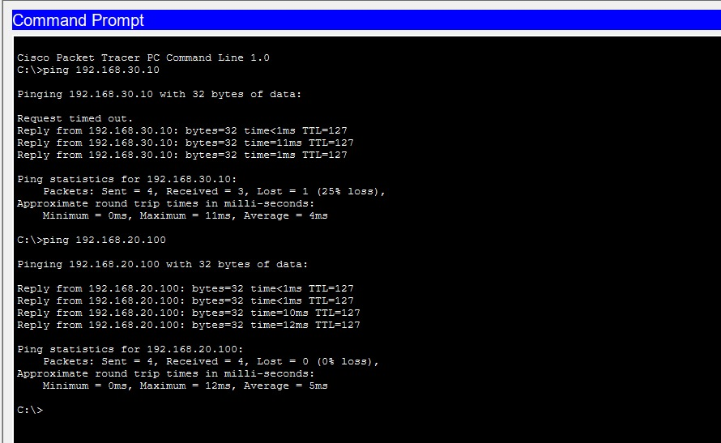

# Enterprise Network Design using Cisco Packet Tracer

## Overview

This project demonstrates the design and implementation of an enterprise network in Cisco Packet Tracer. The network is divided into multiple departments using VLANs to improve organization and reduce unnecessary broadcast traffic. Router-on-a-Stick is used to enable communication between different VLANs, while DHCP and DHCP Relay are configured to automate IP address assignment across the network.

## Technologies Used

- Cisco Packet Tracer
- VLAN
- IEEE 802.1Q Trunking
- Router-on-a-Stick
- DHCP
- DHCP Relay
- DNS

## Network Design

The network consists of:

- One Router
- One Switch
- Six PCs
- One Printer
- One Server

The departments are separated into the following VLANs:

| VLAN | Department | Network |
|------|------------|----------------|
| 10 | HR | 192.168.10.0/24 |
| 20 | Finance | 192.168.20.0/24 |
| 30 | IT | 192.168.30.0/24 |

## Project Features

- VLAN Segmentation
- Access and Trunk Port Configuration
- Inter-VLAN Routing
- Router-on-a-Stick Configuration
- DHCP Configuration
- DHCP Relay using `ip helper-address`
- DNS Configuration
- End-to-End Connectivity Testing

## Screenshots

### Network Topology

### VLAN Configuration

### Router Subinterfaces

### DHCP Configuration

### Connectivity Testing

## Files Included

- Enterprise Office Network.pkt
- Project_Report.pdf
- Router_Config.txt.txt
- Switch_Config.txt.txt

## What I Learned

Working on this project helped me gain practical experience with VLAN segmentation, trunk port configuration, Router-on-a-Stick, DHCP, DHCP Relay, and basic enterprise network troubleshooting. It also improved my understanding of how different network components work together in a real-world environment.

## Author

Bala Venkata Sai Dindu
