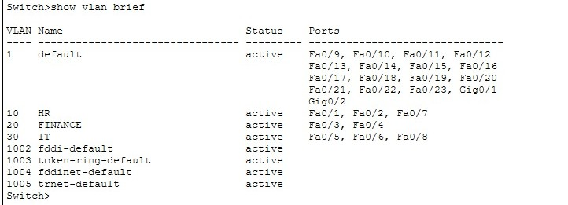
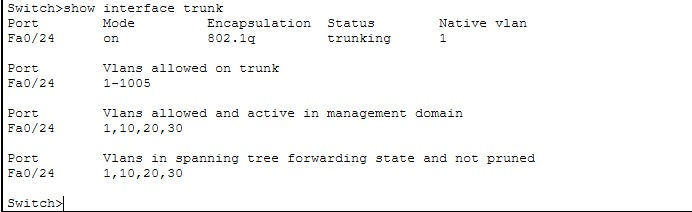
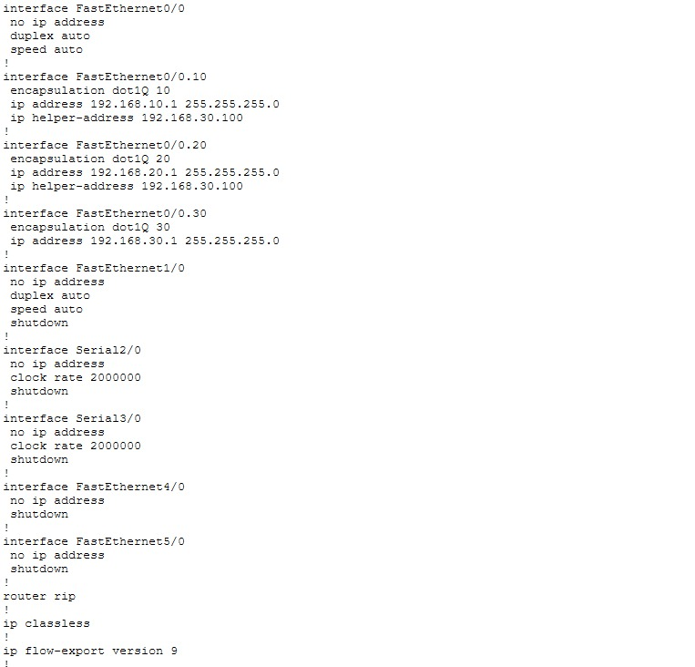
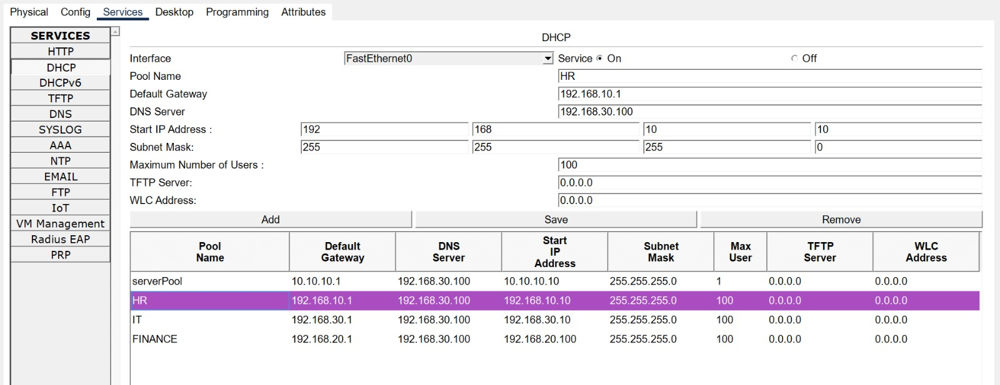
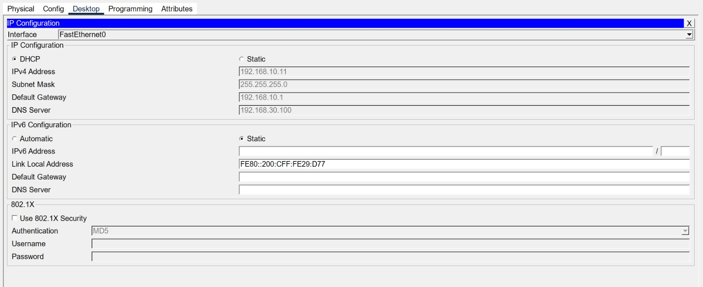

# Enterprise Network Design using Cisco Packet Tracer

## Overview

This project demonstrates the design and implementation of an enterprise network using Cisco Packet Tracer. The network is divided into three departments using VLANs to improve security and network management. Router-on-a-Stick is used for Inter-VLAN Routing, while DHCP, DHCP Relay, and DNS services provide automatic IP address assignment and name resolution across the network.

## Technologies Used

- Cisco Packet Tracer
- VLAN
- IEEE 802.1Q Trunking
- Router-on-a-Stick
- DHCP
- DHCP Relay
- DNS

## Network Design

The network consists of:

- One Router
- One Layer 2 Switch
- Six PCs
- One Printer
- One Server

The departments are separated into the following VLANs:

| VLAN | Department | Network |
|------|------------|----------------|
| 10 | HR | 192.168.10.0/24 |
| 20 | Finance | 192.168.20.0/24 |
| 30 | IT | 192.168.30.0/24 |

## Project Features

- VLAN Segmentation
- Access Port Configuration
- Trunk Port Configuration
- Router-on-a-Stick Configuration
- Inter-VLAN Routing
- DHCP Configuration
- DHCP Relay using ip helper-address
- DNS Configuration
- End-to-End Connectivity Testing

## Network Topology

## VLAN Configuration

## Trunk Configuration

## Router Subinterfaces

## Running Configuration

## DHCP Pools

## Automatic DHCP Configuration

## Connectivity Testing

## Repository Files

- Enterprise Office Network.pkt
- Enterprise_Network_Design_using_Cisco_Packet_Tracer.pdf
- Router_Config.txt
- Switch_Config.txt

## What I Learned

Through this project, I gained practical experience in designing and configuring an enterprise network using Cisco Packet Tracer. I learned how to implement VLANs, configure trunk ports, perform Inter-VLAN Routing using Router-on-a-Stick, deploy DHCP with DHCP Relay, configure DNS, and verify network connectivity through troubleshooting and testing.

## Author

Bala Venkata Sai Dindu
